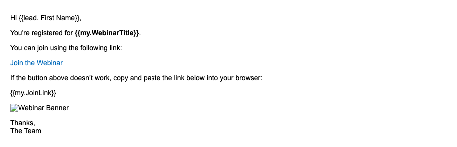

# 如何使用REST API和令牌在Marketo Engage中触发智能营销活动

本教程将指导您了解如何使用REST API在Marketo Engage中触发Smart Campaign，以及使用我的令牌个性化电子邮件。 此用例非常适用于客户触发的通知，例如网络研讨会提醒、入门步骤或购买后跟进。

## 用例 {#use-case}

人员通过外部平台注册网络研讨会（例如，自定义应用程序、Pendo、Eventbrite）。 您希望自动：

* 触发来自Marketo Engage的提醒电子邮件
* 通过以下方式对其进行个性化：
   * 人员的名字
   * 网络研讨会标题
   * 唯一的加入链接

可使用REST API和“我的令牌”完成此操作。

## 步骤1：创建Smart Campaign {#step-one}

1. 转到&#x200B;**营销活动**，然后在[程序](https://experienceleague.adobe.com/zh-hans/docs/marketo/using/product-docs/core-marketo-concepts/programs/creating-programs/understanding-programs){target="_blank"}文件夹下，创建一个名为[的新](https://experienceleague.adobe.com/zh-hans/docs/marketo/using/product-docs/core-marketo-concepts/smart-campaigns/understanding-smart-campaigns){target="_blank"}Smart Campaign`Send Webinar Reminder`。

1. 在&#x200B;**智能列表**&#x200B;选项卡中，[添加触发器](https://experienceleague.adobe.com/zh-hans/docs/marketo/using/product-docs/core-marketo-concepts/smart-campaigns/creating-a-smart-campaign/define-smart-list-for-smart-campaign-trigger){target="_blank"}以允许通过API调用营销活动：

   * 选择&#x200B;**请求营销活动**&#x200B;作为触发器
   * 将&#x200B;**Source**&#x200B;设置为`Web Service API`


## 第2步：定义电子邮件内容 {#step-two}

创建或编辑同时引用人员和[我的令牌](https://experienceleague.adobe.com/zh-hans/docs/marketo-developer/marketo/rest/assets/emails){target="_blank"}的[电子邮件资产](https://experienceleague.adobe.com/zh-hans/docs/marketo/using/product-docs/core-marketo-concepts/programs/tokens/managing-my-tokens){target="_blank"}。

>[!NOTE]
>
>请确保将令牌直接插入电子邮件内容，如下所示。

```html
Hi {{lead.First Name:default=Customer}}

You're registered for **{{my.WebinarTitle}}**.

Join here: {{my.JoinLink}}
```

如果您使用令牌动态插入图像URL（例如`{{my.WebinarImage}}`），则必须将该令牌包裹在HTML图像标记中：

```html

```

>[!IMPORTANT]
>
>除非将令牌放置在有效的图像标记中，否则Marketo Enagage **将不会**&#x200B;渲染图像。



## 步骤3：将令牌添加到程序 {#step-three}

要通过API动态传递值，令牌必须已存在于Marketo Engage中。 您需要在程序的&#x200B;**我的令牌**&#x200B;选项卡下创建它们。

1. 转到您父项目的&#x200B;**我的令牌**&#x200B;选项卡。

2. 从右侧面板为每个动态值拖入&#x200B;**文本令牌**。

* `{{my.WebinarTitle}}` — 文本令牌
* `{{my.JoinLink}}` — 文本令牌
* `{{my.WebinarImage}}` — 文本令牌（这将用作`src`标记中的``）

营销活动中的

## 步骤4：设置活动资格规则并激活活动 {#step-four}

1. 配置[资格规则](https://experienceleague.adobe.com/zh-hans/docs/marketo/using/product-docs/core-marketo-concepts/smart-campaigns/using-smart-campaigns/edit-qualification-rules-in-a-smart-campaign){target="_blank"}以控制人员通过Smart Campaign运行的频率。

1. 配置完毕后，单击&#x200B;**激活**&#x200B;以启用Smart Campaign接收API触发的请求。


## 步骤5：通过REST API触发营销活动 {#step-five}

### 查找营销活动ID {#find-the-campaign-id}

要通过API触发Smart Campaign，您需要&#x200B;**促销活动ID**：

1. 查找并选择要触发的Smart Campaign。

1. 查看浏览器中的URL。 它类似于： `https://app-XXX.marketo.com/#/classic/SC`**1234**`A1ZN38`。

1. `SC`后面的4位是您的促销活动ID，在上例中，Smart Campaign ID为“1234”

使用以下端点：

```
POST /rest/v1/campaigns/{campaignId}/trigger.json
```

示例：

```
POST /rest/v1/campaigns/1234/trigger.json
```

### 示例请求正文 {#example-request-body}

```json
{
  "input": {
    "leads": [
      {
        "id": 1002200
      }
    ],
    "tokens": [
      {
        "name": "{{my.WebinarTitle}}",
        "value": "Scaling Customer Engagement in 2025"
      },
      {
        "name": "{{my.JoinLink}}",
        "value": "https://webinars.company.com/join/abc123"
      },
      {
        "name": "{{my.WebinarImage}}",
        "value": "https://experienceleague.adobe.com/zh-hans/docs/marketo-learn/tutorials/events/media_1c6f338a518ada11550084c8ab3a6bbf554ff6eac.jpeg"
      }
    ]
  }
}
```

>[!IMPORTANT]
>
>将以上正文示例中的`1002200`替换为Marketo Engage实例中的正确人员ID。

## Authorization {#authorization}

所有Marketo REST API请求都需要OAuth 2.0访问令牌。

要检索您的访问令牌，请使用以下端点：

```
GET /identity/oauth/token?grant_type=client_credentials&client_id=XXX&client_secret=YYY
```

收到访问令牌后，请将其作为&#x200B;_查询参数_&#x200B;包含在所有API请求中：

```
Authorization: Bearer YOUR_ACCESS_TOKEN
```

## 最佳实践 {#best-practices}

* 将回退/默认值添加到令牌以进行测试和QA
* 将`{{lead.token}}`用于人员字段，将`{{my.token}}`用于营销活动范围内的动态值
* Marketo Engage支持每个请求最多100人
* 人员必须符合“智能列表”条件，否则，将静默跳过这些人员

## 摘要 {#summary}

通过这种方法，您可以使用通过API从外部平台触发的Smart Campaigns将通信个性化。 这对于网络研讨会注册确认、载入电子邮件和事务性通知等方案非常有用，所有这些情况下都使用“我的令牌”注入实时数据。
